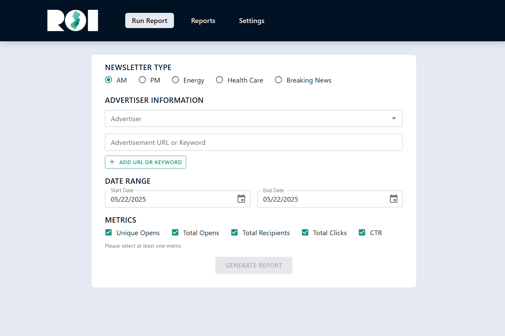
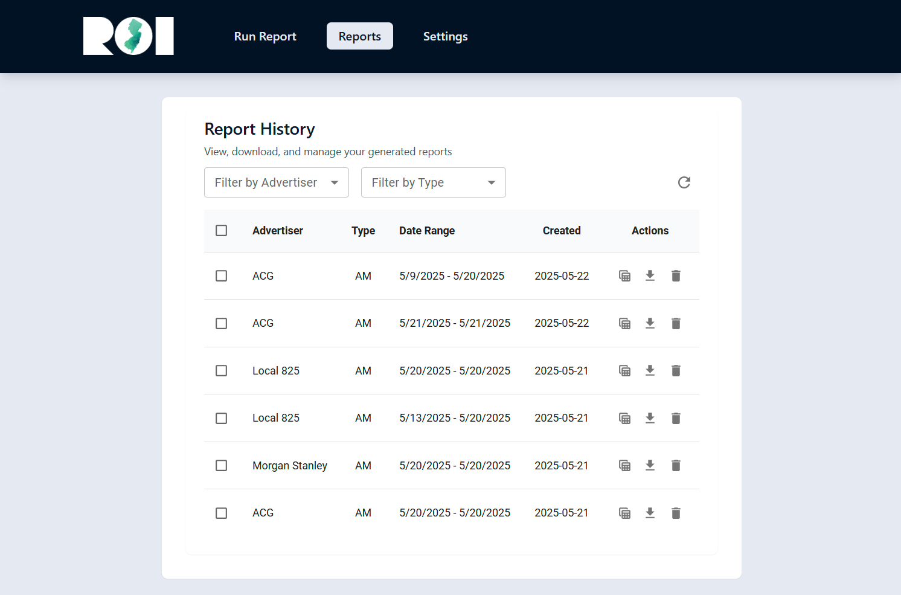
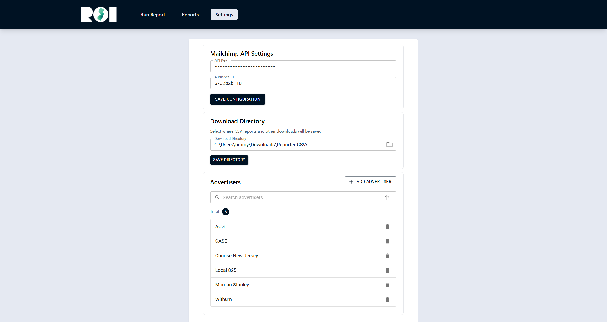

# ROI Mailchimp Reporter

**ROI Mailchimp Reporter** is a cross-platform desktop application built to streamline the process of analyzing and reporting performance metrics for Mailchimp newsletter campaigns. Designed for marketing teams, campaign managers, and ROI analysts, it simplifies the generation of standardized reports, tracks advertiser performance, and enables data-driven decision-making.

---

## 🚀 Features

### 📊 Campaign Report Generation
- Generate performance reports from Mailchimp campaign data
- Filter by date range and newsletter type (AM, PM, Energy, Health Care, Breaking News)
- Track custom advertiser URLs and engagement metrics

### 🗂️ Report Management
- View and download historical reports as CSV
- Open reports directly in Excel
- Batch download/delete capabilities
- Filter by advertiser and newsletter type

### ⚙️ Settings Management
- Configure Mailchimp API credentials
- Add, remove, and search advertisers
- Set and persist download directory preferences

---

## 🧱 Tech Stack

### Frontend
- **React 18 (TypeScript)** – Type-safe, modern UI
- **Tailwind CSS** – Utility-first styling
- **Material-UI (MUI)** – Pre-built components for clean design
- **Zustand** – Lightweight global state management
- **Custom Hooks & Responsive Design** – For clean and maintainable UI

### Backend / System Integration
- **Tauri 2.0** – Rust-powered secure backend with native file system access
- **Rust** – High-performance backend logic for CSV handling, local storage, and security
- **Mailchimp API** – Real-time campaign data retrieval and analytics

---

## 🔒 Security & Performance

- **Secure API credential storage**
- **Local file system isolation and sandboxing**
- **Optimized asynchronous processing**
- **Error handling with retry logic**
- **Caching and validation mechanisms**

---

## 🧠 Developer Practices

- Feature-based directory structure
- Strong type definitions and code organization
- Centralized and persistent state management
- Unit and integration tests for core features
- Graceful error recovery and helpful UI feedback

---

## 👥 Target Users

- Marketing teams
- ROI analysts
- Advertising coordinators
- Campaign managers
- Newsletter editors

---

## 💼 Business Value

- Track ROI per advertiser and newsletter
- Automate report generation and historical analysis
- Improve campaign efficiency with fast insights
- Standardized and professional reporting format

---

## 🌱 Future Roadmap

- 📈 Advanced analytics & charts
- 🧩 CRM & analytics platform integrations
- 🎨 Dark mode and customizable themes
- 🖼️ Custom report templates
- 🔁 Support for other email platforms (Klaviyo, Constant Contact, etc.)

---

## 📸 Screenshots

### Campaign Report design

### Report Viewer

### Settings

---

## 🛠 Setup Instructions

> Coming soon — if you're a recruiter or hiring manager and want to explore the app, feel free to contact me directly for a walkthrough or demo.

---

## 👋 About the Developer

Built by **[Tim Van Cauwenberge](https://www.linkedin.com/in/timothyvancauwenberge/)** – I have a Bachelor's degree in Computer Science and a strong track record of self-taught development beyond the classroom. This project reflects both my formal training and hands-on experience building real tools to solve business problems. I'm passionate about automation, performance-driven design, and marketing analytics, and I built this tool in response to real needs at ROI-NJ.

---

## 📫 Contact

- **Email:** timvancau@gmail.com
- **LinkedIn:** [linkedin.com/in/timothyvancauwenberge](https://www.linkedin.com/in/timothyvancauwenberge/)
- **Portfolio:** [vanCauwenberge.com](https://www.vancauwenberge.com)

---

> If you're hiring for a full-time, contract, or freelance role and are looking for someone who can deliver results, analyze complex data, and build production-level tools — I'd love to chat!
